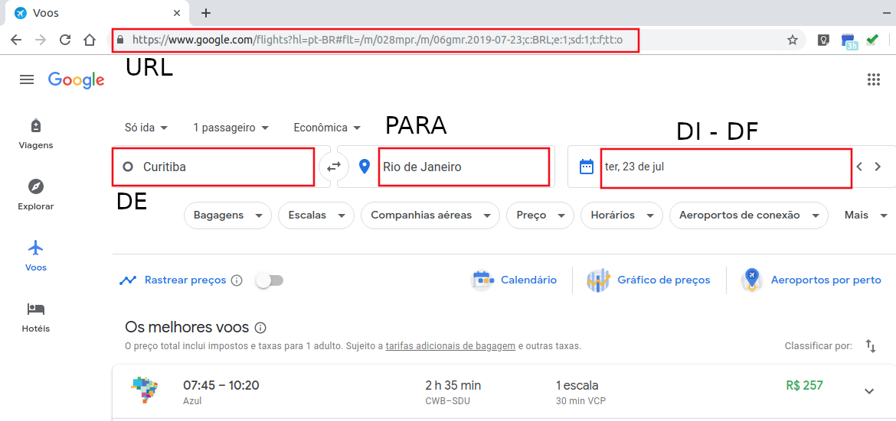
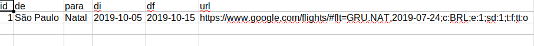

[Google Flights](https://www.google.com/flights/)
=====================================

O Google Flights é um serviço de reserva de voos que oferece informações por
quantidade, preço, duração entre outras informações, as passagens áreas de voos
disponiveis por terceiros. Os scripts disponibilizados servem para coletar
preços de passagens diariamente.  O objetivo da coleta, inicialmente, é
visualizar a precificação das passagens ao longo do tempo fixando um intervalo
de tempo no futuro para a compra das passagens.

A coleta é feita da seguinte forma:

1. Cria-se uma pasta no seguinte caminho, `~/databases/google_flights`, e em
   seguida um arquivo chamado **url.csv**. Neste arquivo criado deve-se
   preencher as informações que se pedem que são *id*, *de*, *para*, *di*, *df*,
   *url*.
2. Depois é coletado as páginas em html de acordo com as informações contidas no
   arquivo **url.csv**.

3. Por último é coletado as informações, tabulado e salvo no banco de dados MySQL.

As informações do arquivo **url.csv** são obtidas do site google flights como é
mostrado na figura abaixo.

Para coletar os dados do Google Flights baixe o repositório e de permissão para
os sequintes arquivos

`chmod +x crontab.R google_flights/google_flights_url.R
google_flights/google_flights_collect.R google_flights/google_flights_scrap.R`

depois 

`Rscript google_flights/google_flights_url.R`

que vai criar a pasta e o arquivo **url.csv**, preencha-o com as informações de
voo que deseja coletar 

e por último execute

`Rscript crontab.R google_flights`

que vai programar para o script `google_flights_collect.R` coletar as páginas
html todos os dias as 9:30 da manhã. Se desejar pode alterar o horário de
execução no seu crontab.
